<p align="center">
  
</p>

<p align="center">
  <a href="https://www.linkedin.com/in/kanishkashukla04/">
    
  </a>
  <a href="mailto:kanishkashukla04@gmail.com">
    
  </a>
  <a href="https://leetcode.com/u/kanishkashukla/">
    
  </a>
  <a href="https://www.hackerrank.com/profile/kiarashukla632">
    
  </a>
  <a href="https://codeforces.com/profile/kanishka04">
    
  </a>
</p>

<br/>

<p align="center">


</p>

<p align="center">

🚀 Building AI Products • 🤖 Open Source Contributor • 📚 B.Tech @ VIT Bhopal

</p>

---

## `> whoami`

```python
kanishka = {
    "name"      : "Kanishka Shukla",
    "role"      : "AI Engineer · Full Stack Developer",
    "university": "VIT  — B.Tech CSE(AI and ML)",
    "focus"     : ["LLMs", "RAG Pipelines", "Agentic AI", "NLP Systems"],
    "stack"     : ["Python", "TypeScript", "Java", "Next.js", "FastAPI"],
    "currently" : "Building KitchenIQ AI, Stellar Portfolio & Agentic AI Systems",
    "seeking"   : "AI Engineer internships · ML roles · Research programs",
    "contact"   : "kanishkashukla04@gmail.com",
}
```

---
## 🚧 Current Mission

<table>
<tr>
<td>

🟢 **Currently Building**
- 🍳 KitchenIQ AI
- 🌌 Stellar Portfolio
- 🤖 Agentic AI Systems

</td>

<td>

🎯 **2026 Goals**
- Secure an AI Engineering Internship
- 🌍 Make meaningful Open Source contributions
- Publish AI Articles
- Build Production AI Applications

</td>
</tr>
</table>

---

## 🧠 AI Focus Areas

<table width="100%">
<tr>
<td width="50%" valign="top">

**Core Research Interests**
- Large Language Models (LLMs)
- Retrieval-Augmented Generation (RAG)
- Agentic AI Pipelines
- Low-resource & Multilingual NLP

</td>
<td width="50%" valign="top">

**Applied Engineering**
- Natural Language Interfaces
- LLM-based Code Generation
- Context Synthesis & Summarization
- Prompt Engineering & Evaluation

</td>
</tr>
</table>

---

## 🛠 Tech Stack

**Languages**


**Frontend**


**Backend**


**Artificial Intelligence**


**Databases**


**Cloud & DevOps**


---

## 🚀 Featured Projects

### [DocuMind AI](https://github.com/KanishkaShukla04/DocuMind-AI) &nbsp;·&nbsp; `Python` `RAG` `LLM`
> End-to-end document intelligence pipeline — processes PDFs, scanned files, and image-based documents through an AI extraction and QA layer.


---

### [GigFlow CRM](https://github.com/KanishkaShukla04/gigflow-crm) &nbsp;·&nbsp; `TypeScript` `React` `Node.js` `MongoDB`
> Full-stack CRM dashboard with JWT auth, role-based access, analytics charts, and CSV export.


---

### [RuntimeForge](https://github.com/KanishkaShukla04/RuntimeForge) &nbsp;·&nbsp; `TypeScript` `Low-Code`
> JSON-driven runtime engine that dynamically generates forms, dashboards, and UI components from config files. A low-code internal tooling system.


---

### [Trinethra](https://github.com/KanishkaShukla04/Trinethra) &nbsp;·&nbsp; `Next.js` `Ollama` `AI`
> AI-powered supervisor feedback analyzer — runs local LLMs via Ollama with a Next.js interface for structured analysis.


---

### [AccentTrainer](https://github.com/KanishkaShukla04/AccentTrainer) &nbsp;·&nbsp; `TypeScript` `NLP` `Speech` &nbsp;·&nbsp; [Live ↗](https://accent-trainer-pi.vercel.app)
> AI chatbot for US vs UK English accent training using real-time speech synthesis and semantic word search.


---

## 📌 Pinned Repositories

> ⚡ Auto-updated every 6 hours via GitHub Actions — reflects your currently pinned repos.

<!-- PINNED-REPOS:START -->
<table width="100%">
<tr>
<td width="50%" valign="top">

**[DocuMind-AI](https://github.com/KanishkaShukla04/DocuMind-AI)**

DocuMind AI processes real-world documents including PDFs, scanned documents, and image-based files.

&nbsp;
&nbsp;


</td>
<td width="50%" valign="top">

**[gigflow-crm](https://github.com/KanishkaShukla04/gigflow-crm)**

Full-stack CRM dashboard with JWT auth, role-based access, analytics charts, CSV export, and responsive UI.

&nbsp;
&nbsp;


</td>
</tr>
<tr>
<td width="50%" valign="top">

**[RuntimeForge](https://github.com/KanishkaShukla04/RuntimeForge)**

JSON-driven runtime application engine that dynamically generates forms, dashboards, and UI components.

&nbsp;
&nbsp;


</td>
<td width="50%" valign="top">

**[Trinethra](https://github.com/KanishkaShukla04/Trinethra)**

AI-powered supervisor feedback analyzer using Next.js and Ollama.

&nbsp;
&nbsp;


</td>
</tr>
</table>
<!-- PINNED-REPOS:END -->

---

## 📊 GitHub Analytics

<p align="center">
  
  &nbsp;
  
</p>

<p align="center">
  
</p>

<p align="center">
  
</p>

<p align="center">
  
</p>

<p align="center">
  
  &nbsp;
  
</p>

<p align="center">
  
  &nbsp;
  
</p>

---

## 🏆 Achievements

<p align="center">
  
</p>

### 🏅 Highlights

- 🥇 Open Source Contributor (ECSoC)
- 🤖 AI & Full Stack Projects
- 📚 B.Tech @ VIT 
- 🚀 Building Production AI Applications

<p align="center">
  
  &nbsp;
  
  &nbsp;
  
</p>

---

## 🌌 Contribution Visualization

> **Pac-Man** eats through your contribution graph — requires one GitHub Action setup (see instructions below).

<p align="center">
  
</p>

<details>
<summary>⚙️ Setup instructions for Pac-Man animation</summary>

Add this workflow to `.github/workflows/pacman.yml` in this repo:

```yaml
name: 🟡 Generate Pac-Man Graph
on:
  schedule:
    - cron: "0 */12 * * *"
  workflow_dispatch:
jobs:
  generate:
    runs-on: ubuntu-latest
    permissions:
      contents: write
    steps:
      - uses: actions/checkout@v4
      - uses: Platane/snk@v3
        with:
          github_user_name: KanishkaShukla04
          outputs: |
            dist/pacman-contribution-graph.svg?palette=github-dark&variant=pacman
      - run: |
          mkdir -p output
          cp dist/pacman-contribution-graph.svg output/
      - uses: crazy-max/ghaction-github-pages@v4
        with:
          target_branch: output
          build_dir: output
        env:
          GITHUB_TOKEN: ${{ secrets.GITHUB_TOKEN }}
```

After the action runs once and pushes to the `output` branch, the Pac-Man SVG above will render automatically.

</details>

---


> *"Building AI that is practical, scalable, and useful."*

---

## 💼 Open to Opportunities

I build systems where AI is the **core product, not an afterthought** — from RAG pipelines to multilingual NLP agents deployed end-to-end.

Actively seeking **AI Engineer internships**, **ML research roles**, and **international research programs** — remote or on-site.

<p align="center">
  <a href="https://www.linkedin.com/in/kanishkashukla04/">
    
  </a>
  &nbsp;
  <a href="mailto:kanishkashukla04@gmail.com">
    
  </a>
</p>

<br/>
<p align="center">

⭐ **If you like my work, consider starring the repositories—it helps and is greatly appreciated!**

</p>

<p align="center">
  
</p>
